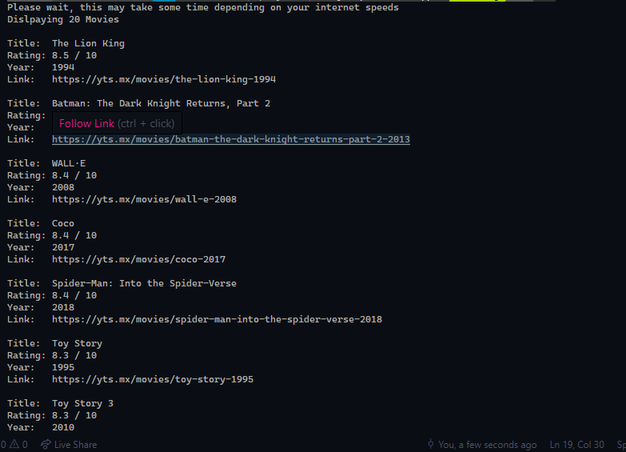

# Ruby-Captsone-Scraper

This is a movie scraper for the movie website yts, It lists movies based on a users choice and links to the specific movies thus eliminating the need to use the browser thus avoiding those annoying pop-ups.

Additional description about the project and its features.

## Built With

- Ruby,
- Nokogiri gem

## Getting Started

To get a local copy up and running follow these simple example steps.

- Clone
- Run bundle install
- run bin/main.rb in terminal

### Run tests

Scraper has been tested with Rspec testing framework. type rspec on the terminal to run the tests.

## Authors

👤 **Asiimwe Dismas**

- Github: [@asiimwedismas](https://github.com/asiimwedismas)
- Twitter: [@asiimwedismas](https://twitter.com/asiimwedismas)
- Linkedin: [asiimwedismas](https://www.linkedin.com/in/asiimwedismas/)

## 🤝 Contributing

Contributions, issues and feature requests are welcome!

## Show your support

Give a ⭐️ if you like this project!

## 📝 License

Note that this is purely for academic purposes, don't use it to illegally download copyrighted movies.

This project is [MIT](lic.url) licensed.
